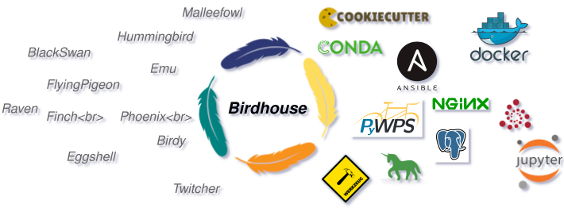

# **Build your Information Systems for FAIR Climate Services.**

|  |
| :--: |
|  |

The following sections are instructions, best practises, examples and backgrounds around **Climate Services Information Systems** underpinning standardised climate services.

In general the deveopers of the various application packages were choosing names for thir software named after bird names, and the entire collection of the software packages are called **birdhouse**. The entire collection of various application packages, utilities and tools are deveoped within various projects and frames and are represeting different stages of maturity. Since this source of application packages are under constant impovement, a variety of generations of standards is present.

Currently there are application packages following the older <glossary:Web Processing Service (WPS)> in the python realisation with [PyWPS](https://pywps.org/).
Newer realistaions are based on **OGC-API Processes** in the realisetion of
[pygeoapi](https://pygeoapi.io/).

<!-- The legacy docs for birds (Web Processing Service) can be found on [GitHub](https://github.com/bird-house/birdhouse-docs) and on [ReadTheDocs](https://birdhouse.readthedocs.io/en/latest/). -->
<!-- Guidelines and tutorials with are realted to the workflows of WPS are documented in the [previous version of birdhouse](https://birdhouse.readthedocs.io/en/latest/)  -->
