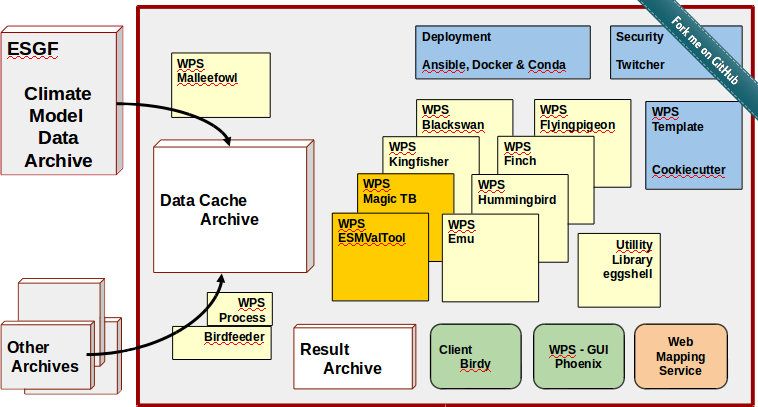

.. _birdhouse_overview:

Architecture
============

.. contents::
    :local:
    :depth: 2

Framework overview
------------------

ESGF_ is currently the main climate data resource (but more resources are possible).
ESGF Solr-index is used to find ESGF data.
The ESGF identity provider with OpenIDs and X509 certificate is used for authentication.

There are several WPS services. Malleefowl_ is the main one for the Phoenix_ client.
Malleefowl is used to search, download (with caching) ESGF data and to retrieve certificates.
Malleefowl has also a workflow engine (dispel4py_) to chain WPS processes.

The results of the WPS processes are stored on the file system and are accessible via URL (with a token id).

Results can be shown on a Map using a Web Mapping Service (ncWMS, adagucserver).

The PyCSW Catalog Service is used to register WPS services and also to publish WPS outputs.
Published results in the PyCSW can also used as input source for processes again.

WPS serivces can be accessed through web-applications like Phoenix or from scripts.

.. note:: See also the `Birdhouse Presentation`_.

.. _Birdhouse Presentation: https://github.com/bird-house/birdhouse-presentation

Birdhouse is the home of Web Processing Services used in climate science and
components to support them (the birds):

.. _client_components:

client side components
----------------------

* `Phoenix`_: a web-based WPS client with ESGF data access
* `Birdy`_: a WPS command line client and native library

* `Phoenix web application <https://github.com/bird-house/pyramid-phoenix/issues>`_
* `Birdy command line WPS client <https://github.com/bird-house/birdy/issues>`_

.. _server_components:
server side components
----------------------

* `Flyingpigeon`_: services for the climate impact community
* `Black Swan`_: services for the extreme weather event assessments
* `Hummingbird`_: provides cdo and compliance-checker as a service
* `Emu`_: some example WPS processes for demo
* `Flyingpigeon WPS for climate impact <https://github.com/bird-house/flyingpigeon/issues>`_
* `Hummingbird WPS processes for cdo and compliance checking <https://github.com/bird-house/hummingbird/issues>`_
* `Emu WPS processes for demo and testing <https://github.com/bird-house/emu/issues>`_
* `Malleefowl WPS base processes to access data <https://github.com/bird-house/malleefowl/issues>`_

Many climate analysis operations are implemented using OpenClimateGIS_ including the `python package icclim <http://icclim.readthedocs.io/en/latest/>`_

* `Twitcher`_: an OWS Security Proxy
* `Twitcher, an WPS security proxy <https://github.com/bird-house/twitcher/issues>`_
* `Malleefowl`_: access to climate data (ESGF, ...) as a service
* `Eggshell`_: provides common functionallity for Birdhouse WPS services

You can find the source code of all birdhouse components on GitHub_.
Docker images with birdhouse components are on `Docker Hub`_

.. _filesandfolder:

Files and Folders
-----------------

.. Warning: outdated

The birds have a similar folder structure. While library dependencies are stored within the conda deployment

Three folder locations have to be pointed out:

* **repository clones:**  The fetched code by ``git clone``. It is recommended to store the repositories in ``~/birdhouse``
* **anaconda**: By default, the installation process creates a folder ``~/anaconda`` for general anaconda-specific software.
* **conda environments:** All birds (repositories) are built with their own environment to avoid missmatch of dependencies.
  By default, the conda environments are in ``~/.conda/envs/``.

To change the default settings, create a ``Makefile.config`` with::

  $ cp Makefile.config.example Makefile.config

and change the paths accordingly to your needs.

Furthermore, in ``environment.yml``, the conda packages can be defined. It is recommended to pin the version. The bird-specific packages are defined here, while in ``requirements/conda_pinned``, general versions are set.

There are **log files** situated at:: ``~/birdhouse/var/log/pywps/``

.. _GitHub: https://github.com/bird-house
.. _`Docker Hub`: https://hub.docker.com/r/birdhouse
