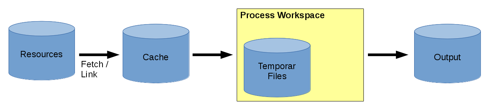
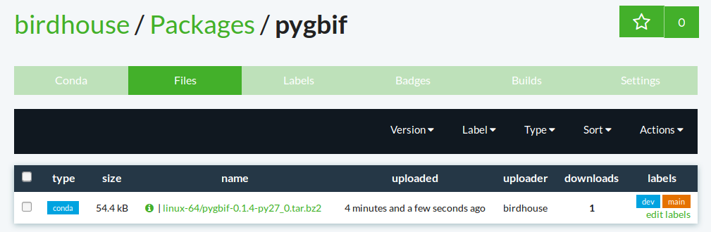
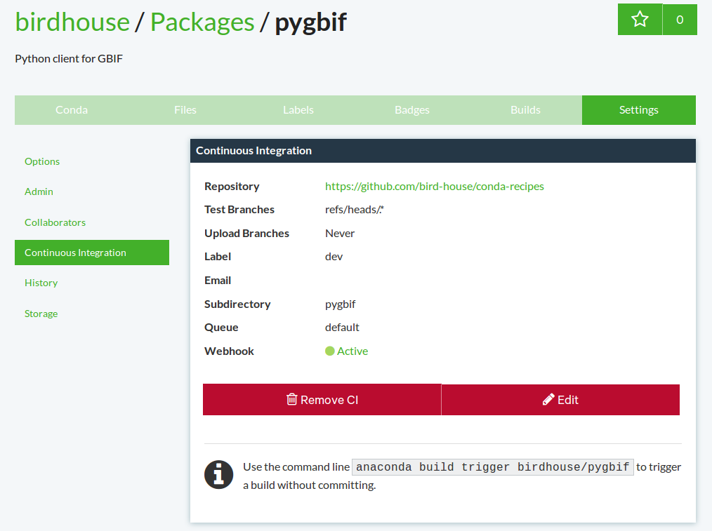

.. _devguide:

Developer Guide
===============

.. contents::
    :local:
    :depth: 3

.. _writing_WPS_process:

Writing a WPS process
---------------------

In birdhouse, we are using the :term:`PyWPS` implementation of a :term:`Web Processing Service`. Writing a WPS process in birdhouse is the same as in PyWPS. The PyWPS documentation has a `tutorial on writing a process <http://pywps.org/docs/>`_. *Please* follow this PyWPS tutorial.

To get started more easily, you can install :ref:`Emu <emu:installation>` with some example processes for PyWPS.

Data production
...............

WPS is designed to reduce data transport and enables data processing close to the data archive. Nevertheless, files are stored within birdhouse in a structured way. For designing a WPS process or process chain, the location of input, output and temporary files are illustrated as follows:

Resources, which are already on the local disc system (output by other processes or as locally stored data archives), are linked into the cache simply with a soft link to avoid data transport and disc space usage.

The locations are defined as follows:

* **Resources:** Any kind of accessable data such as ESGF, thredd server or files stored on the server-side disc system.

* **Cache:** ``~/birdhouse/var/lib/pywps/cache/`` The cache is for external data which are not located on the server side. The files of the cache are separated by the birds performing the data fetch and keep the folder structure of the original data archive. Once a file is already in the cache, the data will not be refetched if a second request is made. The cache can be seen as a local data archive. Under productive usage of birdhouse, this folder is growing, since all requested external data are stored here.

* **Working directory:** ``~/birdhouse/var/lib/pywps/tmp/`` Each process is running in a temporary folder (= working directory) which is removed after the process is successfully executed. Like the cache, the working directories are separated by birds. Resource files are linked into the directory.

* **Output files:** ``~/birdhouse/var/lib/pywps/outputs/`` The output files are also stored in output folders separated by the birds producing the files. In the case of flyingpigeon, you can get the paths with:

.. code-block:: python

   from flyingpigeon import config

   output_path = config.output_path()        # returns the output folder path
   outputUrl_path = config.outputUrl_path()  # returns the URL address of the output folder

And in some special cases, static files are used (e.g. html files to provide general information). These files are located in the repository. In the case of flyingpigeon, they are located at: ``./flyingpigeon/flyingpigeon/static/``

and copied during the installation (or update) to: ``~/birdhouse/var/www/``

.. _processdesign:

Designing a process
-------------------

For designing a process it is necessary to know some basic concepts about how data are produced in birdhouse. The following are some basic explanations to help in developing appropriate processes to provide a scientific method as a service. The word **process** is used in the same sense as in the OGC standard: *for any algorithm, calculation or model that either generates new data or transforms some input data into output data*, and can be illustrated as follows:

.. image:: _images/process_schema_1.png

The specific nature of web processing services is that processes can be described in a standardised way (see:
:ref:`writing_WPS_process`). In the flyingpigeon repository, the process descriptions are located in::

    ./flyingpigeon/flyingpigeon/processes

As part of the process description there is an **execute** function:

.. code-block:: python

   def execute(self):
       # here starts the actual data processing
       import pythonlib
       from flyingpigeon import aflyingpigeonlib as afl

       result = afl.nicefunction(indata, parameter1=argument1, parameter2=argument2)

       self.output.setValue( result )

It is a recommended practice to separate the functions (the actual data processing) from the process description. This creates modularity and enables multiple usage of functions when designing several processes. The modules in flyingpigeon are located here::

    ./flyingpigeon/flyingpigeon

Generally, the execution of a process contains several processing steps, where temporary files and memory values are generated. Birdhouse runs each job in a separate folder, by default situated in::

    ~/birdhouse/var/lib/pywps/tmp/

This tmp folder is removed after job is successfully executed. To reuse temporary files, it is necessary to declare them as output files. Furthermore, during execution, there are steps which are necessary to be successfully performed and a result is called back. If this particular step fails, the whole process should exit with an appropriate error message, while in other cases it is not relevent for producing the final result. The following image shows a theoretical chain of functions:

.. image:: _images/module_chain.png

In pracitice, the functions should be encapsulated in **try** and **except** calls and appropriate information given to the log file or shown as a status message:

.. code-block:: python
   :linenos:

   from pywps.Process import WPSProcess
   import logging
   logger = logging.getLogger(__name__)

   # set a status message
   self.status.set('execution started at : %s ' % dt.now(),5)

   try:
       self.status.set('the process is doing something : %s '  % dt.now(),10)
       result = 42
       logger.info('found the answer of life')
   except Exception as e:
       msg = 'This failed but is obligatory for the output. The process stops now, because: %s ' % e
       logger.error(msg)
       raise Exception(msg)

   try:
       self.status.set('the process is doing something else : %s '  % dt.now(),20)
       interesting = True
       # or generate a temporary file
       logger.info(' Thanks for reading the guidelines ')
   except Exception as e:
       msg = 'This failed but is not obligatory for the output. The process will continue. Reason for the failure: %s ' % e
       logger.debug(msg)

The log file then looks like::

  tail -f  ~/birdhouse/var/log/pywps/flyingpigeon.log

  PyWPS [2016-09-14 11:49:13,819] INFO: Start ocgis module call function
  PyWPS [2016-09-14 11:49:13,820] INFO: Execute ocgis module call function
  PyWPS [2016-09-14 11:49:13,828] DEBUG: input has Lambert_Conformal projection and can not subsetted with geom
  PyWPS [2016-09-14 11:49:13,828] DEBUG: failed for point ['2.356138', ' 48.846450'] Validation failed on the parameter "uri" with the message: Cannot be None
  PyWPS [2016-09-14 11:49:13,993] INFO: Start ocgis module call function
  PyWPS [2016-09-14 11:49:13,994] INFO: Execute ocgis module call function
  PyWPS [2016-09-14 11:49:14,029] INFO: OcgOperations set
  PyWPS [2016-09-14 11:49:14,349] INFO: tas as variable dedected
  PyWPS [2016-09-14 11:49:14,349] INFO: data_mb  = 0.0417938232422 ; memory_limit = 1660.33984375
  PyWPS [2016-09-14 11:49:14,349] INFO: ocgis module call as ops.execute()
  PyWPS [2016-09-14 11:49:16,648] INFO: Succeeded with ocgis module call function

Another point to think about when designing a process is the possibility of chaining processes together. The result of a process can be a final result or be used as an input for another process. Chaining processes is a common practice but depends on the user you are designing the service for.
Technically, for the development of WPS process chaining, here are a few summary points:

*    the functional code should be modular and provide an interface/method for each single task
*    provide a wps process for each task
*    wps processes can be chained, manually or programmatically, to run a complete workflow
*    wps chaining can be done manually, with workflow tools, direct wps chaining or with code scripts
*    a complete workflow chain could also be started by a wps process.

.. image:: _images/wps_chain.png

In birdhouse, restflow and dispel4py are integrated, and WPS chaining is used in the wizard of phoenix. This WPS chain fetches data and runs a process (selected by the user) with the fetched data : http://pyramid-phoenix.readthedocs.io/en/latest/user_guide.html#wizard

Here is a tutorial to follow: :ref:`chaining_WPS`.

or:

http://birdhouse.readthedocs.io/en/latest/appendix.html#scientific-workflow-tools

.. _writing_docs:

Writing Documentation
---------------------

Documentation is written in `ReStructuredText <http://sphinx-doc.org/rest.html>`_ and generated with `Sphinx <http://sphinx-doc.org/index.html>`_. The birdhouse components use the Buildout recipe `birdhousebuilder.recipe.sphinx <https://pypi.python.org/pypi/birdhousebuilder.recipe.sphinx>`_ which sets up Sphinx and a minimal ``docs`` folder. With ``make docs`` the documentation is generated locally. The documentation is published to `Read the Docs <https://readthedocs.org/>`_ with each commit to the `master` branch. The API reference is generated automatically using the Sphinx plugin `AutoAPI <http://sphinx-autoapi.readthedocs.io/en/latest/index.html>`_.

* http://sphinx-doc.org/tutorial.html
* http://quick-sphinx-tutorial.readthedocs.io/en/latest/

.. _anaconda:

Using Anaconda in birdhouse
---------------------------

The installation of the birdhouse components and especially the processes involve many software dependencies. The core dependencies are of course the WPS-related packages like :term:`PyWPS` and :term:`OWSLib` from the :term:`GeoPython` project. But most dependencies come from the processes themselves served by the WPS, such as `numpy`, `R`, `NetCDF`, `CDO`, `matplotlib`, `ncl`, `cdat`, and many more.

The aim of birdhouse is to take care of all these dependencies so that the user does not need to install them manually. If these dependencies were only *pure* Python packages, then using the :term:`Buildout` build tool, together with the Python package index :term:`PyPi`, would be sufficient. But many Python packages have `C` extensions and there are also non-Python packages that need to be installed like `R` and :term:`NetCDF`.

In this situation, the :term:`Anaconda Python distribution` is helpful. Anaconda already has a lot of Python-related packages available for different platforms (Linux, MacOSX, Windows), and there is no compilation needed on the installation host. Anaconda makes it easy to build own packages (*conda recipes*) and upload them to the free :term:`Anaconda Server`.

Conda recipes by birdhouse
..........................

Birdhouse uses :term:`Anaconda` to maintain package dependencies.
Anaconda allows you to write your own `conda recipes <http://conda.pydata.org/docs/build.html>`_.
In birdhouse, we have written several conda recipes for the packages that were not available on Anaconda.
These `additional conda recipes by birdhouse <https://github.com/bird-house/conda-recipes>`_ are available on GitHub.
Some of the missing packages are: :term:`PyWPS`, :term:`OWSLib`, :term:`cfchecker`, :term:`Nginx`, ...

Anaconda provides a free :term:`Anaconda Server`. Here you can upload your built conda packages for different platforms (Linux, MacOX, Windows). These packages are then available for installation with the :term:`conda` installer.

`Birdhouse has an organisation <https://anaconda.org/birdhouse>`_ where all conda packages are collected which are
built from the conda recipes on GitHub. These packages can be installed with the :term:`conda` installer using the `birdhouse` channel.
For example, if you are already using Anaconda, you can install :term:`PyWPS` with the following command:

.. code-block:: sh

    $ conda install --channel birdhouse pywps

Building conda packages
.......................

There are several ways to build conda packages and upload them to the *Anaconda Server*:

* You can `build packages locally <http://conda.readthedocs.io/en/latest/#building-your-own-packages>`_ and upload them with the Binstar command line tool.
* You can also `build packages remotely on Anaconda <https://docs.continuum.io/anaconda-cloud/build>`_. Additionally, you can set a GitHub Webhook so that on each commit of your recipe, a build will be run on Binstar.
* The remote builds on Anaconda are done using Docker images. The `Anaconda docker image for Linux-64 <https://hub.docker.com/r/binstar/linux-64/>`_ is available on :term:`Docker Hub`.

In birdhouse, we usually use the remote build on Anaconda which is triggered by commits to GitHub.
But sometimes the docker image for Linux-64 provided by Binstar fails for some packages.
That is why `birdhouse has in addition its own Linux-64 build image <https://hub.docker.com/r/birdhouse/binstar-linux-64/>`_ which is based on the Anaconda image.
The `Dockerfile for this image <https://github.com/bird-house/birdhouse-build/tree/master/docker/binstar-linux-64>`_ is on GitHub.

.. warning::

   When you build conda packages for Linux-64, you need to be very careful to ensure that these packages will run on most Linux distributions (like :term:`CentOS`, :term:`Debian`, :term:`Ubuntu`, ...). Our experience is that packages tjat build on CentOS 6.x will also run on recent Debian/Ubuntu distributions. The Docker build images are also CentOS 6.x based.

.. note::

   You can build a conda package with the provided docker image for Linux-64. See the `readme <https://github.com/bird-house/birdhouse-build/tree/master/docker/binstar-linux-64>`_ on how to use it.

.. note::

   For future conda packages, one should use the community-driven `conda-forge channel <https://conda-forge.github.io/>`_.

.. _conda_example:

Example: building a conda package for pygbif
............................................

``pygbif`` is a Python package available on :term:`PyPi`. Generate conda package files using ``conda skeleton``::

    $ conda skeleton pypi pygbif
    $ cd pygbif
    $ vim meta.yaml  # check dependencies, test, build number
    $ vim build.sh   # for non-python packges, here is most of the work to do

Enable anaconda build::

    $ cd pygbif
    $ anaconda-build init
    $ vim .binstar.yml

Edit the anaconda config (``binstar.yml``) to have the following entries (change the package name for a different recipe):

.. literalinclude:: binstar.yml
    :language: yaml
    :linenos:

See the conda recipe on `GitHub <https://github.com/bird-house/conda-recipes/tree/master/pygbif>`_.

Run binstar build for the first time:

.. code-block:: sh

    $ binstar package --create birdhouse/pygbif
    $ anaconda-build submit .
    $ anaconda-build tail -f birdhouse/pygbif 1    # checks logs

On successful build, go to the birdhouse channel on binstar and search for the `pygbif package` (``http://anaconda.org/birdhouse/pygbif/files``).
Go to the ``files`` tab and add the channel `main` for the successfully-built package.
All packages on the `main` channel are available for public usage.

Register GitHub webhook for pygbif:

on the Anaconda Server, go to `Settings/Continuous Integration` of the ``pygbif`` package.

Edit the fields:

* `github.com/` = `bird-house/conda-recipes`
* Subdirectory = pygbif

.. warning::

   If you're logged into anaconda with your own rather than the `birdhouse` organization account, then the ``anaconda-build submit .`` way mentioned above seems to cause some problems (as of October 2015). A more reliable way to upload your package is to build it locally, upload it to your own account and then transfer the ownership to `birdhouse` via the web interface:

.. code-block:: sh

    $ anaconda-build init # just as before
    $ vim .binstar.yaml
    $                     # skip package creation here
    $ conda build .       # build locally
    $ anaconda upload /your/path/to/conda-bld/platform/packagename-version.tar.bz2 # full path is listed in conda build output

   Now switch to `anaconda.org/yourname/packagename` and go to `Settings` -> `Admin` -> `Transfer` to transfer the package to `birdhouse`. (You could use ``-u birdhouse`` to upload it to `birdhouse` directly, but it seems to make some difference e.g. some fields in the web interface will not be filled in automatically, so I figured the other workaround to be more reliable.)

Using conda
...........

See the `conda documentation <http://conda.pydata.org/docs/index.html>`_.

.. warning::

   To fix the SSL cert issues in conda when updating to python 2.7.9, do the following::

     $ conda config --set ssl_verify False
     $ conda update requests openssl
     $ conda config --set ssl_verify True

   See this conda issue at https://github.com/conda/conda/issues/1624

Anaconda alternatives
.....................

If Anaconda is not available, one could also provide these packages from source and compile them on each installation host. Buildout does provide ways to do so, but an initial installation with most of the software used in climate science could *easily take hours*.

Alternative package managers to Anaconda are for example :term:`Homebrew` (MacOSX only) and :term:`Linuxbrew` (a fork of Homebrew for Linux).

Using Buildout in birdhouse
---------------------------

Birdhouse uses the :term:`Buildout` build tool to install and configure all birdhouse components (:term:`Phoenix`, :term:`Malleefowl`, :term:`Emu`...). The main configuration file is ``buildout.cfg`` which is in the root folder of the application.
As an example, have a look at the `buildout.cfg from Emu <https://github.com/bird-house/emu/blob/master/buildout.cfg>`_.

Before building an application with Buildout, you have an initial bootstrap step:

.. code-block:: s

    $ python bootstrap-buildout.py -c buildout.cfg

This will generate the ``bin/buildout`` script.
Now you can build the application:

.. code-block:: sh

    $ bin/buildout -c buildout.cfg

The default configuration in the ``buildout.cfg`` should always work to run your application on ``localhost`` with default ports. You can customize the configuration by editing the ``custom.cfg`` which extends and overwrites the settings of ``buildout.cfg``. You may have a look at the
`custom.cfg example of Emu <https://github.com/bird-house/emu/blob/master/custom.cfg.example>`_. So, instead of using ``buildout.cfg``, you should use ``custom.cfg`` for the build:

.. code-block:: sh

    $ bin/buildout -c custom.cfg

For convenience, birdhouse has a Makefile which hides all these steps. If you want to build an application, you just need to run:

.. code-block:: sh

    $ make install

See the `Makefile example of Emu <https://github.com/bird-house/emu/blob/master/Makefile>`_
For more details, see the :ref:`installation` section and the :ref:`Makefile documentation <bootstrap:makefile>`.

Buildout recipes by birdhouse
.............................

:term:`Buildout` has a plugin mechanism to extend the build tool functionality with `recipes <http://www.buildout.org/en/latest/docs/recipe.html>`_. Buildout can handle Python dependencies on its own. But in birdhouse, we install most dependencies with Anaconda. We are using a Buildout extension to install conda packages with Buildout. Buildout does use these Python packages instead of downloading them from :term:`PyPi`.
There is also a set of recipes to set up Web Processing Services with :term:`PyWPS`, :term:`Nginx`, :term:`Gunicorn` and :term:`Supervisor`.
All these `Buildout recipes are on GitHub <https://github.com/bird-house?query=birdhousebuilder.recipe>`_ and can be `found on PyPi <https://pypi.python.org/pypi?%3Aaction=search&term=birdhousebuilder.recipe&submit=search>`_.

Here is the list of currently-used Buildout recipes by birdhouse:

* `birdhousebuilder.recipe.conda <https://pypi.python.org/pypi/birdhousebuilder.recipe.conda>`_: A Buildout recipe to install Anaconda packages.
* `birdhousebuilder.recipe.pywps <https://pypi.python.org/pypi/birdhousebuilder.recipe.pywps>`_: A Buildout recipe to install and configure PyWPS Web Processing Service with Anaconda.
* `birdhousebuilder.recipe.pycsw <https://pypi.python.org/pypi/birdhousebuilder.recipe.pycsw>`_: A Buildout recipe to install and configure pycsw Catalog Service (CSW) with Anaconda.
* `birdhousebuilder.recipe.nginx <https://pypi.python.org/pypi/birdhousebuilder.recipe.nginx>`_: A Buildout recipe to install and configure Nginx with Anaconda.
* `birdhousebuilder.recipe.supervisor <https://pypi.python.org/pypi/birdhousebuilder.recipe.supervisor>`_: A Buildout recipe to install and configure supervisor for Anaconda.
* `birdhousebuilder.recipe.docker <https://pypi.python.org/pypi/birdhousebuilder.recipe.docker>`_: A Buildout recipe to generate a Dockerfile for birdhouse applications.
* `birdhousebuilder.recipe.sphinx <https://pypi.python.org/pypi/birdhousebuilder.recipe.sphinx>`_: A Buildout recipe to generate documentation with Sphinx.
* `birdhousebuilder.recipe.ncwms <https://pypi.python.org/pypi/birdhousebuilder.recipe.ncwms>`_: A Buildout recipe to install and configure ncWMS2 Web Map Service.
* `birdhousebuilder.recipe.adagucserver <https://pypi.python.org/pypi/birdhousebuilder.recipe.adagucserver>`_: A Buildout recipe to install and configure Adagucserver Web Map Service.

Python Packaging
----------------

Links:

* https://packaging.python.org/

Example:

.. code-block:: sh

    $ python setup.py sdist
    $ python setup.py bdist_wheel
    $ python setup.py register -r pypi
    $ twine upload dist/*

Check the rst docs in the long_description of ``setup.py``:

* https://github.com/collective/collective.checkdocs

Example:

.. code-block:: sh

    $ python setup.py checkdocs

Python Code Style
-----------------

Birdhouse uses `PEP8`_ checks to ensure a consistent coding style. Currently the following PEP8 rules are enabled
in ``setup.cfg``:

.. code-block:: ini

   [flake8]
   ignore=F401,E402
   max-line-length=120
   exclude=tests

See the `flake8`_ documentation on how to configure further options.

To check the coding style run ``flake8``:

.. code-block:: sh

    $ flake8 emu   # emu is the folder with python code
    # or
    $ make pep8    # make calls for you flake8

To make it easier to write code according to the PEP8 rules enable PEP8 checking in your editor.
In the following we give examples how to enable code checking for different editors.

Atom
....

* Homepage: https://atom.io/
* PEP8 Atom Plugin: https://github.com/AtomLinter/linter-pep8

.. image:: _images/atom-pep8.png

Sublime
.......

* Install package control if you don't already have it: https://packagecontrol.io/installation#st2
* Follow the instructions here to install Python PEP8 Autoformat: https://packagecontrol.io/packages/Python%20PEP8%20Autoformat
* Edit the settings to conform to the values used in birdhouse, if necessary
* To show the ruler and make wordwrap default, open Preferences → Settings—User and use the following rules

.. code-block:: python

   {
    // set vertical rulers in specified columns.
    "rulers": [79],

    // turn on word wrap for source and text
    // default value is "auto", which means off for source and on for text
    "word_wrap": true,

    // set word wrapping at this column
    // default value is 0, meaning wrapping occurs at window width
    "wrap_width": 79
    }

PyCharm
.......

TODO

Kate
....

TODO

Emacs
.....

TODO

Vim
...

TODO

Spyder
......

TODO

.. _PEP8: https://www.python.org/dev/peps/pep-0008/
.. _flake8: http://flake8.pycqa.org/en/latest/
