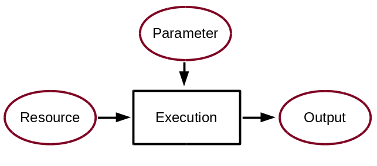
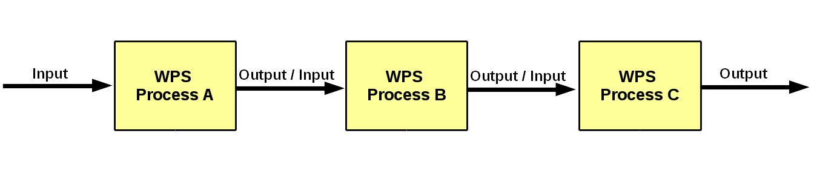
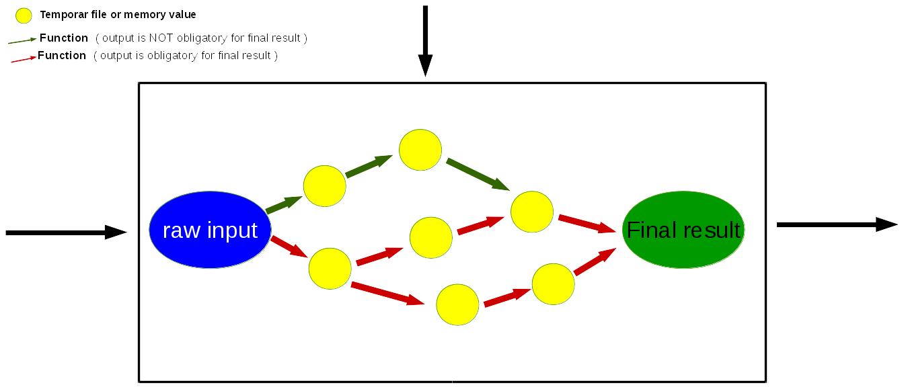

.. _guide_WPS:

WPS design
==========

.. contents::
    :local:
    :depth: 1

.. _writing_WPS_process:

Writing a WPS process
.....................

In birdhouse, we are using the PyWPS_ implementation of a :term:`Web Processing Service`.
Please read the `PyWPS documentation <https://pywps.readthedocs.io/en/master/process.html>`_
on how to implement a WPS process.

.. note:: To get started quickly, you can try the Emu_ WPS with some example processes for PyWPS.

Another point to think about when designing a process is the possibility of chaining processes together. The result of a process can be a final result or be used as an input for another process. Chaining processes is a common practice but depends on the user you are designing the service for.
Technically, for the development of WPS process chaining, here are a few summary points:

*    the functional code should be modular and provide an interface/method for each single task
*    provide a wps process for each task
*    wps processes can be chained, manually or within the code, to run a complete workflow
*    wps chaining can be done manually, with workflow tools, direct wps chaining or with code scripts
*    a complete workflow chain could also be started by a wps process.

.. _writing_functions:

Writing functions
.................

A Process is calling several functions during the performance. Since WPS is a autonom running process several eventualities needs to be taken into account. If irregularities are occurring, it is a question of the process design if the performance should stop and return an error or continue with may be an modified result.

In practice, the functions should be encapsulated in **try** and **except** calls and appropriate information given to the logfile or shown as a status message. The logger has several options to to influence the running code and the information writing to the logfile:

.. code-block:: python
   :linenos:

   # the following two line needs to be in the beginning of the *.py file.
   # The ._handler will find the appropriate logfile and include timestemps
   # and module information into the log.

   import logging
   LOGGER = logging.getLogger("PYWPS")

   # set a status message
   per = 5  # 5 will be 5% in the status line
   response.update_status('execution started at : {}'.fromat(dt.now()), per)

   try:
       response.update_status('the process is doing something: {}'.fromat(dt.now()),10)
       result = 42
       LOGGER.info('found the answer of life')
   except Exception as ex:
       msg = 'This failed but is obligatory for the output. The process stops now, because: {} '.format(ex)
       LOGGER.error(msg)

   try:
       response.update_status('the process is doing something else : {}'.fromat(dt.now()), 20)
       interesting = True
       LOGGER.info(' Thanks for reading the guidelines ')
       LOGGER.debug(' I need to know some details of the process: {} '.format(interesting)
   except Exception as ex:
       msg = 'This failed but is not obligatory for the output. The process will continue. Reason for the failure: {} '.format(ex)
       LOGGER.exception(msg)

.. _writing_docs:

Writing documentation
.....................

Last but not least, a very very important point is to write a good documentation about your work! Each WPS (bird) has a docs folder for this where the documentation is written in reStructuredText_ and generated with Sphinx_.

* http://sphinx-doc.org/tutorial.html
* http://quick-sphinx-tutorial.readthedocs.io/en/latest/

The documentation is automatically published to ReadTheDocs_ with GitHub webhooks.
It is important to keep the :ref:`codestyle` and write explanations to your functions. There is an auto-api for documentation of functions.

.. todo:: explanation of enabling spinx automatic api documentation.

The main `documentation`_ (which you are reading now) is the starting point to
get an overview of birdhouse. Each birdhouse component comes with
its own Sphinx documentation and is referenced by the main birdhouse document. Projects using birdhouse components like PAVICS_ or `COPERNICUS Data Store`_ generally have their own documentation as well. To include documentation from external repository here, two custom made sphinx directives can be used. The `gittoctree` directive behaves like a normal table of content directive (`toctree`), but takes as an argument the URL to the git repo and refers to files inside this directory through their full path. The `gitinclude` directive acts like an normal `include` directive, but takes as a first argument the URL to the git repo this file belongs to. For example:

.. code-block:: sphinx
   :linenos:

   Here is the text of the birdhouse main documentation. At the place where you want to integrate
   a part of a remote sphinx documentation stored in a `git` repository you can fetch the docs
   parts and integrated it with a table of content referring to external files:

   .. gittoctree:: https://github.com/Ouranosinc/pavics-sdi.git

      docs/source/arch/backend.rst

   or include an individual file:

   .. gitinclude:: https://github.com/Ouranosinc/pavics-sdi.git docs/source/arch/backend.rst

   The directive will clone and checkout the repository, then include these external files as if
   they were part of the native documentation.

 .. _writing_tests:

 Writing tests
 .............

 Writing tests is an essential part of software development. The WPS templates produced by Cookiecutter_ include the initial folders needed for units tests and basic dependencies in the environment.
 There are two parts of tests:

 * Unit tests:
 python pytest to check the functionality of functions and processes. They are stored in the folder `{bird WPS}/tests` and appropriate test data  `{bird WPS}/tests/testdata`.

 * notebook tests:
 Code examples of the documentation to demonstrate the usage of WPS services. The examples are written in jupyter notebooks and stored in the documentation folder `{bird WPS}/docs/source/notebooks/`

.. note:: Look at the Emu_ to see examples.
