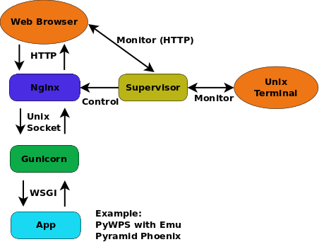
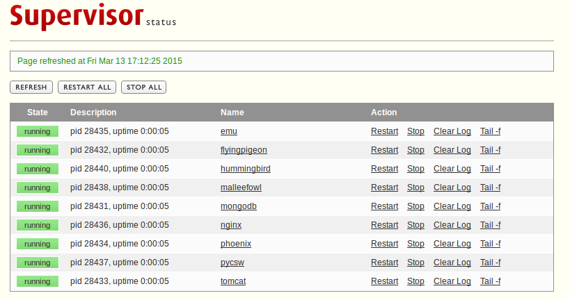

.. _guide_install:

birdhouse installation
=======================

.. contents::
    :local:
    :depth: 2

.. warning:: This section is outdated ...

Birdhouse consists of several components like Malleefowl_ and Emu_. Each of them can be installed individually.
The installation is done using the Python-based build system :term:`Buildout`.
Most of the dependencies are maintained in the :term:`Anaconda Python distribution`.
For convenience, each birdhouse component has a :ref:`Makefile <bootstrap:makefile>`
to ease the installation so you don't need to know how to call the Buildout build tool.

.. _requirements:

Requirements
------------

Birdhouse uses :term:`Anaconda Python distribution` for most of the dependencies. If Anaconda is not already installed, it will be installed during the installation process. Anaconda has packages for Linux, MacOSX and Windows. But not all packages used by birdhouse are already available in the default package channel of Anaconda. The missing packages are supplied by birdhouse on :term:`Binstar`. But we currently maintain only packages for Linux 64-bit and partly for MacOSX.

So the short answer to the requirements is: **you need a Linux 64-bit installation**.

Birdhouse is currently used on Ubuntu 14.04 and CentOS 6.x. It should also work on Debian, LinuxMint and Fedora.

Birdhouse also installs a few system packages using `apt-get` on Debian based distributions and `yum` on RedHat/CentOS based distributions. For this you need a user account with `sudo` permissions. Installing system packages can be done in a separate step. So your installation user does not need any special permissions. All installed files will go into a birdhouse Anaconda environment in the home folder of the installation user.

Installing from source
----------------------

The installation of birdhouse components from source is done with some few commands. Here is an example for the Emu WPS service:

.. code-block:: sh

    $ git clone https://github.com/bird-house/emu.git
    $ cd emu
    $ make clean install
    $ make start
    $ firefox http://localhost:8094/wps

All the birdhouse components follow the same installation pattern. If you want to see all the options of the `Makefile` then type:

.. code-block:: sh

    $ make help

You will find more information about these options in the :ref:`Makefile documentation <bootstrap:makefile>`.

Read the documention of each birdhouse component for the details of the installation and how to configure the components. The :ref:`birdhouse bootstrap documentation <bootstrap:introduction>` gives some :ref:`examples <bootstrap:examples>` of the different ways of making the installation.

On the WPS client side we have:

* `Phoenix`_: a Pyramid web application.
* `Birdy`_: a simple WPS command line tool.

On the WPS server side we have:

* `Malleefowl`_: provides base WPS services to access data.
* `Flyingpigeon`_: provides WPS services for the climate impact community.
* `Hummingbird`_: provides WPS services for CDO and climate metadata checks.
* `Emu`_: just some WPS processes for testing.

Nginx, gunicorn and supervisor
------------------------------

Birdhouse sets up a :term:`PyWPS` server (and also the Phoenix web application) using :term:`Buildout`. We use the :term:`Gunicorn` HTTP application server (similar to Tomcat for Java servlet applications ) to run these web applications with the :term:`WSGI` interface. In front of the Gunicorn application server, we use the :term:`Nginx` HTTP server (similar to the Apache web server). All these web services are started/stopped and monitored by a :term:`Supervisor` service.

See the following image for how this looks like:

When installing a birdhouse WPS service, you don't need to care about this setup. This is all done by Buildout and using some extensions provided by birdhouse.

The Makefile of a birdhouse application has convenience targets to start/stop a WPS service controlled by the Supervisor and to check the status:

.. code-block:: sh

    $ make start    # start wps service
    $ make stop     # stop wps service
    $ make status   # show status of wps service
    Supervisor status ...
    /home/pingu/.conda/envs/birdhouse/bin/supervisorctl status
    emu                              RUNNING   pid 25698, uptime 0:00:02
    malleefowl                       RUNNING   pid 25702, uptime 0:00:02
    mongodb                          RUNNING   pid 25691, uptime 0:00:02
    nginx                            RUNNING   pid 25699, uptime 0:00:02
    phoenix                          RUNNING   pid 25694, uptime 0:00:02
    pycsw                            RUNNING   pid 25700, uptime 0:00:02
    tomcat                           RUNNING   pid 25693, uptime 0:00:02

You can also use the Supervisor monitor web service which by default is available on port http://localhost:9001/. The Supervisor monitor app looks like in the following screenshot.

.. _docker:

Using birdhouse with Docker
---------------------------

An alternative way to install and deploy birdhouse Web Processing Services is by using :term:`Docker`.
The birdhouse WPS servers are available as a Docker image on `Docker Hub <https://hub.docker.com/r/birdhouse/>`_.
See an example on how to use them with the :ref:`Emu WPS Docker image <emu:tutorial>`.
