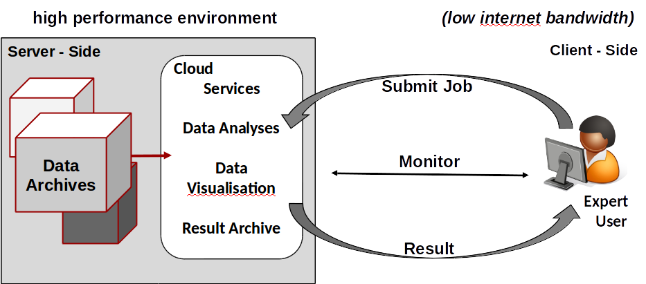

.. _overview:

********
Overview
********

.. contents::
    :local:
    :depth: 2

.. _introduction:

Introduction
------------

Birdhouse is a collaborative project open for the community to participate. It is a software framework containing a collection of
`Web Processing Service`_ (WPS). The deployed algorithms are focusing on Earth Systems and environmental data processing with the
philosophy of streamlining the software development and deployment. By supporting climate, earth observation and biodiversity data
and processes, Birdhouse can be used in a wide array of Earth sciences projects and workflows. The core benefit of this project is to
allow the seamless use of climate services developed by a diverse network of national meteorological offices, regional climate service
providers, academics, not-for-profit research centers and private industry. As governments move toward open-data policies, there will
be a need for analytical services that extract value out of the deluge of information. Using an interoperable software architecture,
institutions can provide both data and services allowing users to process the data remotely from a laptop, instead of having to acquire
and maintain large storage infrastructures.

.. _what_is_wps:

What is WPS?
-----------

**Geographic Information Processing for the Web**
    *The Web Processing Service (WPS) offers a simple web-based method of finding, accessing, and using all kinds of calculations and models*.

A WPS is a technical solution (WPS Concepts) in which processes are hosted on a server and accessed over the web (Fig. 1). These processes con-
form to a standardized format, ensuring that they follow the principle of reusable design: they can be instantiated multiple times for different input
arguments or data sources, customized following the same structure to handle new inputs, and are modular, hence can be combined to form new processes.
In addition, a WPS can be installed close to the data to enable processing directly out of the archive. A WPS can also be linked to a theoretically limit-
less combination of several other WPSs, or generally OpenGIS Web Services (OWS).
Our understanding of process is used in the same sense as in the OGC standard: ’for any algorithm, calculation or model that either generates new data or trans-
forms some input data into output data’. A submitted process is a job. A service provides a collection of processes containing scientific methods
that focus on climate impact and extreme weather events. A combination of processes is called a workflow, and a collection of WPS-related software
compartments is a framework. WPS divides the operation into server and client side, with appropriate security in between to avoid misuse.

.. note:: Read the documentation on `Geographic Information Processing for the Web <http://geoprocessing.info/wpsdoc/>`_

.. _wps_use_case:

WPS Use Case
-----------
.. todo:: needs to be updated.

A user runs WPS processes *remotely* on a machine with direct access to climate data archives.

.. image:: _images/wps_adamsteer.png
