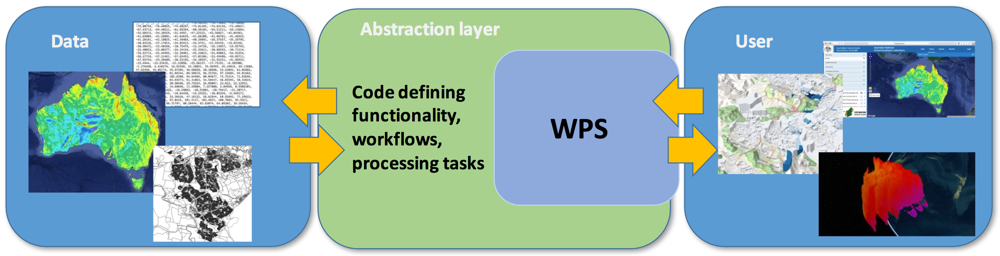

.. _overview:

Overview
========

.. contents::
    :local:
    :depth: 2

.. todo:: The Birdhouse Overview needs to be updated.

.. _introduction:

Introduction
------------

Birdhouse is a collaborative project open for the community to participate. It is a software framework containing a collection of
`Web Processing Service`_ (WPS). The deployed algorithms are focusing on Earth Systems and environmental data processing with the
philosophy of streamlining the software development and deployment. By supporting climate, earth observation and biodiversity data
and processes, Birdhouse can be used in a wide array of Earth sciences projects and workflows. The core benefit of this project is to
allow the seamless use of climate services developed by a diverse network of national meteorological offices, regional climate service
providers, academics, not-for-profit research centers and private industry. As governments move toward open-data policies, there will
be a need for analytical services that extract value out of the deluge of information. Using an interoperable software architecture,
institutions can provide both data and services allowing users to process the data remotely from a laptop, instead of having to acquire
and maintain large storage infrastructures.

.. _what_is_wps

What is WPS?
-----------

**Geographic Information Processing for the Web**
    *The Web Processing Service (WPS) offers a simple web-based method of finding, accessing, and using all kinds of calculations and models*.

.. image:: _images/WPS_principe.png

.. note:: Read the documentation on `Geographic Information Processing for the Web <http://geoprocessing.info/wpsdoc/>`_

.. _wps_use_case:

WPS Use Case
-----------

A user runs WPS processes *remotely* on a machine with direct access to climate data archives.

