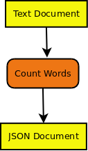
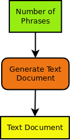
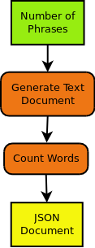

.. _wps_tutorial:

WPS general usage
-----------------
General concepts and tutorials for pyWPS:

* `PyWPS 4.0.0 Slides <http://www.slideshare.net/jachym/pywps400>`_
* `PyWPS Documentation <https://pywps.readthedocs.io/en/master/process.html>`_

You can connect to a WPS service in the following ways:

* using a command-line tool in your terminal.
* using a web based application from your browser.
* using a Python library from a jupyter notebook or your Python scripts.

Get familliar with WPS (emu):
-----------------------------

.. todo:: include Emu tutorial

Wordcounter Example
===================

.. todo:: The WPS tutorial needs to be updated.

In the following we show an example with a `Word Counter` function which is enabled as a web-service using WPS.

.. contents::
    :local:
    :depth: 2

Defining a `Word Counter` function
----------------------------------

In the following example we will use the `Word Counter` function::

    def count_words(file):
        """Calculates number of words in text document.
        Returns JSON document with occurrences of each word.
        """
        return json_doc

This Python function has the following parts:

* a `name` or `identifier`: count_words
* a `description`: Calculates number of words ...
* `input parameters`: file (mime type `text/plain`)
* `output parameters`: json_doc (mime type `application/json`)

Now, we would like to run this function remotely using a simple web-service.
To get this web-service we can use WPS. The function parts (name, parameters) are all we need to know to define a WPS process.

WPS definition of `Word Counter`
--------------------------------

To add a new proccess you need to define the input and output parameters. For the `Word Counter` process this looks like the following.

Here is another example for a `Text Generator` process. We will use it later for chaining processes.

There are two types of input/output parameters:

* Literal Parameters (green): these are simple data types like integer, boolean, string, ...
* Complex Parameters (yellow): these are documents with a mime-type (xml, cvs, jpg, netcdf, ...) provided as URL or directly.

An input/output parameter has:

* a name or `identifier`
* a descriptive `title`
* an `abstract` giving a description of the parameter
* `multiplicity` ... how often can this parameter occur: optional, once, many ...
* in case of literal parameters a list of `allowed values`.

For more details see the following `WPS Tutorial`_.

.. _chaining_WPS:

Chaining WPS processes
----------------------

If you know the input/output parameters of processes you can chain processes. For example we will chain a `Text Generator` process to
our `Word Counter` process.

The `Text document` output of the `Text Generator` process becomes the input of `Word Counter` process.

You can chain process manually by calling them one after the other. The WPS specification allows you to also chain process with a single WPS request.
To get even more flexibility (using if-clauses, loops, monitoring ...) you can also use a :term:`workflow engine <workflow>` (:term:`Taverna`, :term:`VisTrails`, :term:`Dispel4py`, ...).

You will find more details about chaining in the `GeoProcessing document <http://geoprocessing.info/wpsdoc/Concepts#chaining>`_
and the `GeoServer Tutorial <http://geoserver.geo-solutions.it/edu/en/wps/chaining_processes.html>`_.

WPS process implementation with PyWPS
-------------------------------------

There are several WPS implementations available (:term:`GeoServer`, :term:`COWS`, ...). In birdhouse, we use the Python implementation :term:`PyWPS`.
In `PyWPS` the `Word Counter` process could look like the following:

.. literalinclude:: _tutorial/wps_word_counter.py
    :language: python
    :emphasize-lines: 8,16,24,32
    :linenos:

You can see the definition of the input and output parameters and the ``execute()`` method where the real ``count_words()`` function is called. You will find more details about implementing a WPS process in the `PyWPS Tutorial <http://pywps.org/docs/>`_.

Using WPS
---------

A WPS service has three operations:

* `GetCapabilities`: which processes are available
* `DescribeProcess`: what are the input and output parameters of a specific process
* `Execute`: run a process with parameters.

The following diagram shows these operations:

.. image:: ../_images/wps_usage.png

To call these process one can use simple HTTP request with key/value pairs:

* `GetCapabilites` request::

   http://localhost:8094/wps?&request=GetCapabilities&service=WPS&version=1.0.0

* `DescribeProcess` request for `wordcount` process::

   http://localhost:8094/wps?&request=DescribeProcess&service=WPS&version=1.0.0&identifier=wordcount

* `Exceute` request::

   http://localhost:8094/wps?request=Execute&service=WPS&version=1.0.0&identifier=wordcount
                           &DataInputs=text=http://birdhouse.readthedocs.org/en/latest/index.html

A process can be run `synchronously` or `asynchronously`:

* sync: You make a HTTP request and you need to wait until the request returns with a response (or timeout). This is only useful for short-running processes.
* async: You make a HTTP request and you get immediately a response document. This document gives you a link to a status document which you need to poll until the process has finished.

Processes can be run with simple HTTP get-requests (as shown above) and also with HTTP post-requests. In the later case XML documents are exchanged with the
communication details (process, parameters, ...).

For more details see the following `WPS Tutorial`_.

There are also some `IPython notebooks <http://nbviewer.jupyter.org/github/bird-house/birdhouse-docs/tree/master/notebooks/tutorial/>`_ which show the usage of WPS.

Calling `Word Counter` with Birdy
---------------------------------

Now, we are using Birdy_ wps command line client to access the `wordcount` process.

Which proccess are available (`GetCapabilities`)::

  $ birdy -h
  usage: birdy [-h] <command> [<args>]

  optional arguments:
    -h, --help            show this help message and exit

  command:
    List of available commands (wps processes)

    {chomsky,helloworld,inout,ultimatequestionprocess,wordcount}
                        Run "birdy <command> -h" to get additional help.

What input and output parameters does `wordcount` have (`DescribeProcess`)::

  $ birdy wordcount -h
  usage: birdy wordcount [-h] --text [TEXT] [--output [{output} [{output} ...]]]

  optional arguments:
    -h, --help            show this help message and exit
    --text [TEXT]         Text document: URL of text document, mime
                        types=text/plain
    --output [{output} [{output} ...]]
                        Output: output=Word count result, mime
                        types=text/plain (default: all outputs)

Run `wordcount` with a text document (`Execute`)::

  $ birdy wordcount --text http://birdhouse.readthedocs.org/en/latest/index.html
  Execution status: ProcessAccepted
  Execution status: ProcessSucceeded
  Output:
  output=http://localhost:8090/wpsoutputs/emu/output-37445d08-cf0f-11e4-ab7e-68f72837e1b4.txt

..  _WPS Tutorial: http://wiki.ieee-earth.org/Documents/GEOSS_Tutorials/GEOSS_Provider_Tutorials/Web_Processing_Service_Tutorial_for_GEOSS_Providers/Section_2:_Introduction_to_WPS

.. rubric:: Footnotes

.. [#what_is_wps] What is WPS? - http://geoprocessing.info/wpsdoc/Concepts#what
